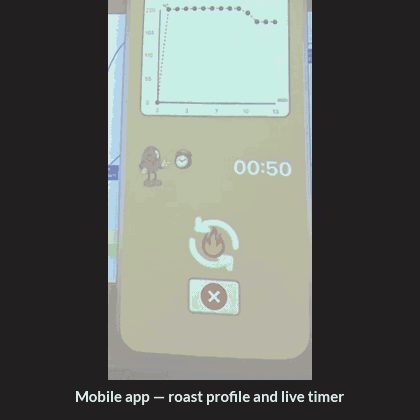
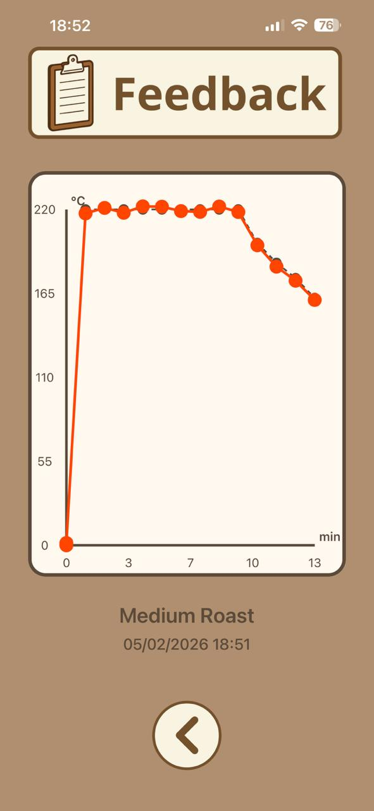
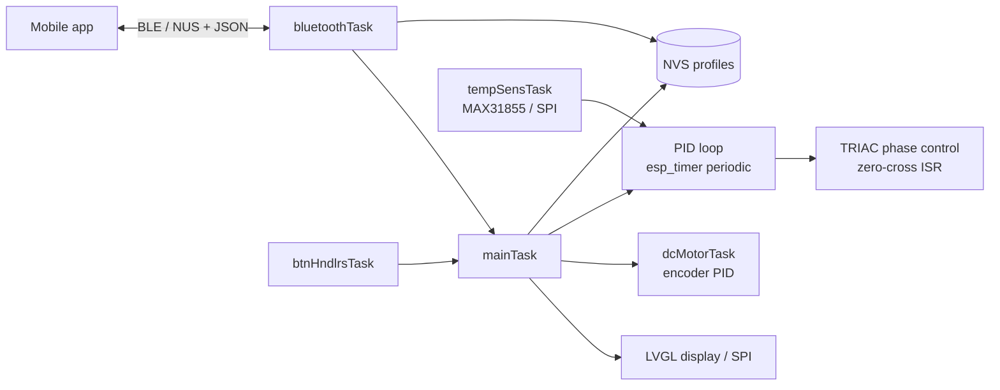
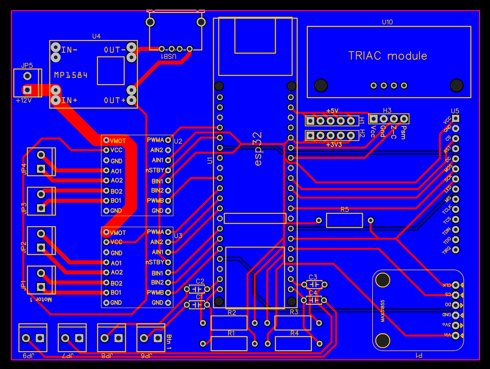

# Roast'aBean — Embedded Firmware

Firmware for **Roast'aBean**, an automated coffee roaster that follows a temperature profile in
closed loop. ESP32-S3 · ESP-IDF · FreeRTOS · C.
Undergraduate thesis project (Computer Engineering, UTFPR, 2025–2026).

<p align="center">
  
  &nbsp;<b>➡️</b>&nbsp;
  
</p>

## What it does

- Receives a **roast profile** (target temperature per minute) from the mobile app over **BLE** and
  stores multiple profiles in flash (NVS).
- Runs a **discrete PI controller** on the heater: reads a K-type thermocouple (MAX31855, SPI) and
  drives the heating element through **TRIAC phase control** synchronized to the mains zero crossing.
- Uses a **disperser disk** speed profile with a brushed DC motor (TB6612 driver) for better heat distribution.
- Shows roast progress as a live graph on an **LVGL display** and accepts local commands from physical buttons.
- Streams telemetry back to the app during the roast.
- **Releases the beans automatically** when the profile ends.

## Architecture



FreeRTOS tasks are pinned to **core 1** with explicit priorities (main > buttons > BLE > temperature >
motor).

| Module | Responsibility |
|---|---|
| `src/main` | Boot sequence, task creation, Kconfig options |
| `src/PIDControl` | Profile tracking and PI temperature control |
| `src/TriacControl` | Heater power via TRIAC phase-angle control |
| `src/DCMotor` | Disc motor (TB6612) with speed PID on encoder feedback |
| `src/SPI` | Shared SPI bus: thermocouple (`TempSens`) and display (`Display`) |
| `src/Bluetooth` | NimBLE GATT server, Nordic UART Service, JSON commands |
| `src/NVShndlr` | Profile storage in NVS (blobs, with compaction on delete) |
| `src/Buttons` | Debounced buttons and handlers |
| `src/Utils` | JSON parsing, time helpers |
| `tests/functional/bluetooth` | Python BLE client to send profiles and read telemetry |

## Technical decisions

- **PI, not PID.** The thermal process is slow and the thermocouple signal is noisy; the derivative
  term amplified noise without improving tracking. Integral term is clamped (anti-windup).
- **Gains from system identification.** The heater/disc response was identified from input-response
  data in a HIL setup, and the controller was designed and verified in MATLAB/Simulink before
  deployment.
- **PID on a periodic `esp_timer`**, not a task delay, so the control period stays fixed regardless
  of task load.
- **Nordic UART Service + JSON** over BLE: a widely supported profile, simple to consume from the app
  and from the Python test client.
- **Boot order matters:** BLE is initialized first and advertising is paused while the TRIAC driver
  and SPI bus come up -> SPI initialization can get interrupted by BLE events.

## Build and flash

Requires **ESP-IDF v5.5.0** -> [official installation guide](https://docs.espressif.com/projects/esp-idf/en/v5.5.0/esp32s3/get-started/index.html).

### Managed components / dependencies:

```bash
idf.py add-dependency lvgl/lvgl^8
idf.py add-dependency espressif/esp_lvgl_port^2
idf.py add-dependency esp-idf-lib/max31855
```

### Build, flash and monitor:

```bash
idf.py set-target esp32s3
idf.py build flash monitor
```

### Send a test profile over BLE:

```bash
cd tests/functional/bluetooth
pip install -r requirements.txt
python ble_send_data.py --file example_roast_profile.json
```

## Hardware

ESP32-S3 controlled board with custom power board (TRIAC stage with zero-cross detection), H-bridge, display and thermocouple peripherals. Hardware design files are not part of this repository.


## Related

- Mobile app (React Native): Private repository, contact the author for access.

---
© 2025–2026 João Vitor Caversan. All rights reserved.
